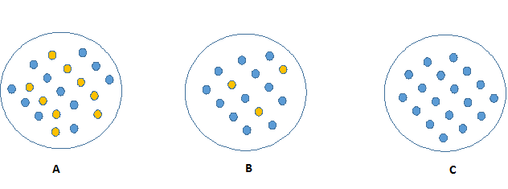
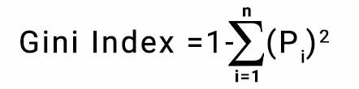

# Decision Trees

## Introduction

Decision trees are a type of [non-parametric](https://deepai.org/machine-learning-glossary-and-terms/non-parametric-model) algorithms supervised machine learning algorithm that uses a tree like structure in order to solve problems. Decision trees can:

- Be used for classification and regression
- Works both for categorical and continous type variables

Decision trees try to split the data into datasets based on conditions. The split occurs when the algorithm decides the most significant splitter from the features. The goal of the algorithm is to make a prediction of the target variable by learning decision rules from data. Since they are non-parametric, you can use this algorithm where you have litte or no knowledge on your dataset.

Decision tree looks like a reversed tree, with it's root at the top. In a decision tree, the every condition is split into it's outcomes until there are no segregations anymore. The conditions are called **internal nodes**, each split from conditions are **branches**, and the branch that cannot split anymore is called a **leaf branch**, which is the final decision of the condition.

Decision trees make the following assumptions:

- The whole data is considered as the root in the first step.
- Discretization of continous variables (transform into a discrete form) is required
- Records are distributed recursively from attribute values.
- Order to placing attributes as root or internal node of the tree is done by using some statistical approach.

When there are more than one algorithm used as a predictor, these algorithms are called [ensemble methods](https://en.wikipedia.org/wiki/Ensemble_learning). For decision trees, it is when one more than one tree is used as a predictor. Some known ensemble algorithms are:

- Boosted trees
- Bootstrap aggregated (Bagged) trees
- Random forests

### Advantages

- It is very useful algorithm to identify the significant variables or can find the relation between variables.
- Requires less data cleaning. Does not get effected by missing values or outliers as other algorithms gets effected.
- Explanation the outcome is easy with if else conditions.
- Works like a human decision making process.
- Great visualization techniques available

### Disadvantages

- High probability for overfitting the dataset.
- Accuracy of a decision tree tend to be lower than other datasets.
- Computation can become complex when there are more labels in target variable.
- Categorical variables with lots of categories can create bias.

## Terminology

### Root Node

In the begining it represents the entire sample or population (dataset). Gets divided into multiple homogeneous sets.

### Decision Node

Decision node is the division of a sub-node into sub-nodes.

### Leaf

Nodes that are not able to split are leafs. They are also called Terminal nodes.

### Pruning

It is opposite of splitting. We remove sub-nodes of a decision tree.

### Branch/ Subtree

Any sub-section within the tree is called a branch or sub-tree.

## How the Algorithm Works

Following steps repeated until the algorithm arrives to an answer. This is valid for all algorithms of model.

1. Pick the best attribute that can split the data that will have the most target variables together in one set.
2. With this attribute, split the dataset. This will create new nodes in the decision tree.
3. For each split, repeat the process of splitting on the best attribute.
4. Stop creating new nodes if all samples in the node is from the same class, if no feature provides any value, or if the tree reaches to it's maximum depth.

## Metrics

### Information Gain and Entropy

**Information gain** refers to higher amount of information obtained from the action. On the contrary, **Entropy** is the disorganization of the system. In decision tree, it is the homogeneouity of the node after the split. Look at the below picture.

C here has the most information gain and no entropy, since it is homogeneous. However, A looks equally divided (50-50) therefore it has 0 information gain but has an entropy of 1.

Entropy goes between 0 and 1, with 0.5 is the highest and edges being the lowest.

### Gini Index

Gini index calculates the probability of a specific feature that is classified incorrectly when selected randomly. It indicates how pure the leaf nodes are.

Ginit index varies between 0 and 1. O means purity of the classification, which means all the samples belong to the same class in the node. 1 indicates the random distribution of various classes. and 0.5 means it is equally distributed over the classes.

To determine gini index, we substract 1 from sum of squared probabilities of each class.

## Cost Functions (Algorithms)

### ID3 (Iterative Dichotomiser 3)

[ID3](https://en.wikipedia.org/wiki/ID3_algorithm) Algorithm iteratively tries to divide the feature into 2 or more groups.

This algorithm iterates on every unused feature and calculates either the entropy or the information gain. Then, based on what's calculated it tries to find the best result of the metric. For entropy, it is the smallest and for information gain it is the largest.

Generally used with nominal attributes (mutually exclusive) for classsication problems.

<!-- ### C4.5 -->

### CART (Classification And Regression Trees)

CART is simply an umbrella term for decision trees that evaluates the model decision making based on **Gini's impurity index**. Algorithm works like this:

1. Find each feature's best split which maximizes Gini's score.
2. CART algorithm searches the best homogeneity for the sub-nodes until the pure sub-set is found.

## Pruning

Pruning is used to increase the performance of a tree by removing branches that has features with low importance. By this operation, the complexity of the tree reduces and decreases the chances of overfitting the data.

There are a lot of methods, like  cost complexity pruning, weakest link prunining. The simplest form is to remove node if it reduces accuracy.

## Random Forests

## Notes and Further 

- https://deepai.org/machine-learning-glossary-and-terms/random-forest
- https://towardsdatascience.com/decision-trees-for-classification-id3-algorithm-explained-89df76e72df1
- https://medium.com/analytics-steps/understanding-the-gini-index-and-information-gain-in-decision-trees-ab4720518ba8
- https://www.python-course.eu/Decision_Trees.php
- https://nbviewer.org/gist/jwdink/9715a1a30e8c7f50a572