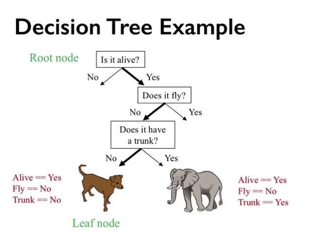
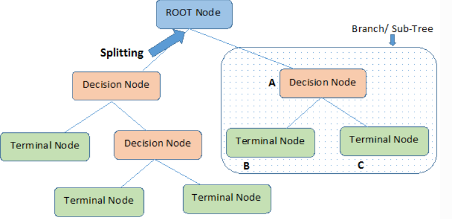

# Decision Trees

## Introduction

Decision trees are a type of [non-parametric](https://deepai.org/machine-learning-glossary-and-terms/non-parametric-model) algorithms supervised machine learning algorithm that uses a tree like structure in order to solve problems. Decision trees can:

- Be used for classification and regression
- Works both for categorical and continous type variables

Decision trees try to split the data into datasets based on conditions. The split occurs when the algorithm decides the most significant splitter from the features. The goal of the algorithm is to make a prediction of the target variable by learning decision rules from data. Since they are non-parametric, you can use this algorithm where you have litte or no knowledge on your dataset.

Decision tree looks like a reversed tree, with it's root at the top. In a decision tree, the every condition is split into it's outcomes until there are no segregations anymore. The conditions are called **internal nodes**, each split from conditions are **branches**, and the branch that cannot split anymore is called a **leaf branch**, which is the final decision of the condition.

Decision trees make the following assumptions:

- The whole data is considered as the root in the first step.
- Discretization of continous variables (transform into a discrete form) is required
- Records are distributed recursively from attribute values.
- Order to placing attributes as root or internal node of the tree is done by using some statistical approach.

When there are more than one algorithm used as a predictor, these algorithms are called [ensemble methods](https://en.wikipedia.org/wiki/Ensemble_learning). For decision trees, it is when one more than one tree is used as a predictor. Some known ensemble algorithms are:

- Boosted trees
- Bootstrap aggregated (Bagged) trees
- Random forests

### Advantages

- It is very useful algorithm to identify the significant variables or can find the relation between variables.
- Requires less data cleaning. Does not get effected by missing values or outliers as other algorithms gets effected.
- Explanation the outcome is easy with if else conditions.
- Works like a human decision making process.
- Great visualization techniques available

### Disadvantages

- High probability for overfitting the dataset.
- Accuracy of a decision tree tend to be lower than other datasets.
- Computation can become complex when there are more labels in target variable.
- Categorical variables with lots of categories can create bias.

## Terminology

### Root Node

In the begining it represents the entire sample or population (dataset). Gets divided into multiple homogeneous sets.

### Decision Node

Decision node is the division of a sub-node into sub-nodes.

### Leaf

Nodes that are not able to split are leafs. They are also called Terminal nodes.

### Pruning

It is opposite of splitting. We remove sub-nodes of a decision tree.

### Branch/ Subtree

Any sub-section within the tree is called a branch or sub-tree.

## How the Algorithm Works

Following steps repeated.

1.

## Cost Functions (Algorithms)

### ID3

### C4.5

### CART

## Metrics

### Information Gain and Entropy

### Gini Index

## Pruning

## Random Forests