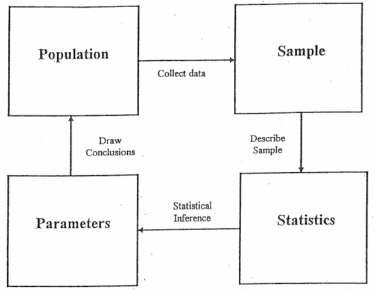

# Predictive Analytics Intro

## Table of Contents

- [Predictive Analytics Intro](#predictive-analytics-intro)
  - [Table of Contents](#table-of-contents)
  - [Introduction](#introduction)
  - [Review Terminology](#review-terminology)
  - [Statistics Recap](#statistics-recap)
    - [Descriptive Statistics](#descriptive-statistics)
      - [Measures of Center](#measures-of-center)
      - [Measures of Dispersion (Variability)](#measures-of-dispersion-variability)
    - [Inferential Statistics](#inferential-statistics)
  - [Fuel Economy Case Study](#fuel-economy-case-study)
  - [References](#references)

## Introduction

Predictive modeling is creating a mathematical model to accurately predict future events based on previous or historical data.

There are many successful use cases of predictive analytics. 

[Forbes magazine](https://www.forbes.com/sites/zinamoukheiber/2014/02/19/ibm-and-epic-apply-predictive-analytics-to-electronic-health-records/) reports that the use of data mining and predictive analytics has helped to identify patients who have been of the greatest risk of developing congestive heart failure. IBM collected 3 years of data pertaining to 350,000 patients, and including measurements on over 200 factors, including things such as blood pressure, weight, and drugs prescribed. Using predictive analytics, IBM was able to identify the 8500 patients most at risk of dying of congestive heart failure within 1 year.

[Dell](https://www.wsj.com/articles/BL-CIOB-1283) was interested in improving the productivity of its sales workforce. It therefore turned to data mining and predictive analytics to analyze its database of potential customers, in order to identify the most likely respondents. Researching the social network activity of potential leads, using LinkedIn and other sites, provided a richer amount of information about the potential customers, thereby allowing Dell to develop more personalized sales pitches to their clients. The number of prospects that needed to be contacted was cut by 50%, leaving only the most promising prospects, leading to a near doubling of the productivity and efficiency of the sales workforce, with a similar increase in
revenue for Dell.

Examples of the types of questions one would like to predict are:

- How many copies will this book sell?
- Will this customer move their business to a different company?
- How much will my house sell for in the current market?
- Does a patient have a specific disease?
- Based on past choices, which movies will interest this viewer?
- Should I sell this stock?
- Which people should we match in our online dating service?
- Is an e-mail spam?
- Will this patient respond to this therapy?

That indicates a desire to know the future, and to act upon this feature. To make a decision, we either have an intuition or we base on an information. Where a human cannot process information at large, a machine can and big companies like Microsoft, Google, WebMM, develop tools that can provide accurate estimations every day.

## Review Terminology

- The terms **sample**, **data point**, **observation**, or **instance** refer to a single, independent unit of data, such as a customer, patient, or compound. The term sample can also refer to a subset of data points, such as the training set sample. The text will clarify the appropriate context when this term is used.
- The **training set** consists of the data used to develop models while the test or validation sets are used solely for evaluating the performance of a final set of candidate models.
- The **predictors**, **independent variables**, **attributes**, or **descriptors** are the data used as input for the prediction equation.
- **Outcome**, **dependent variable**, **target**, **class**, or **response** refer to the outcome event or quantity that is being predicted.
- **Continuous data** have natural, numeric scales. Blood pressure, the cost of an item, or the number of bathrooms are all continuous. In the last case, the counts cannot be a fractional number, but is still treated as continuous data.
- **Categorical data**, otherwise known as nominal, attribute, or discrete data, take on specific values that have no scale. Credit status (“good” or “bad”) or color (“red,”“blue,” etc.) are examples of these data.
- **Model building**, **model training**, and **parameter estimation** all refer to the process of using data to determine values of model equations.

## Statistics Recap

Statistics is the language to use when understanding science. It gives you a way to induct the nature's behaviour by looking into a small portion of observations.

Statistics is the science of collecting, organizing, summarizing, analyzing, and interpreting information.

In general, the cycle of statistics is shown below. This summarizes with a good collection of samples from population, we can draw conclusions about the population.

There are two branches of statistics:

- Descriptive Statistics
- Inferential Statistics

### Descriptive Statistics

This type of statistics is to provide measures to describe the data. Using descriptive statistics, you can summarize the data with mean, median, range, etc. It is a representation of the sample dataset and there is no inference about the data or it doesn't use probability theory. Descriptive statistics helps us to **understand data attributes**.

Commonly used measurements are:

- Measures of Center
- Measures of Dispersion

#### Measures of Center

Measures the center of the dataset.

- Mean
- Median
- Mode

#### Measures of Dispersion (Variability)

Measures the variability or the spread of the dispersion of the data within the set.

- Range
- Variance
- Standard Deviation
- Quartiles
- Skewness
- Kurtosis

### Inferential Statistics

Using inferential statistics, one can understand the collective properties of the sample dataset. Knowing the sample mean, variance, and distribution of a variable can help us understand the world around us. With inferential statistics, we can use our sample statistics and **extend the results to the population**, while measuring the reliability of the result.

A population means the entire group that you are interested in. For example, all students in our school, students in data science program, or students in all USA can be a population. A sample is a subset of the population.

There are 2 areas of inferential statistics.

- Estimating parameters: take a measure from your sample data (i.e, mean, median, etc.) and say something about the population
- Hypothesis Testing: answer your research question. (i.e, Is this drug effective? etc.)

One can infer characteristics of the population from samples using below techniques.

- Sampling Distribution of the Sample Mean
- Central Limit Theorem
- Sampling Distribution of the Sample Proportion
- Confidence Intervals

## Fuel Economy Case Study

The [fueleconomy.gov](https://fueleconomy.gov/) web site, run by the U.S. Department of Energy’s Office of Energy Efficiency and Renewable Energy and the U.S. Environmental Protection Agency, lists different estimates of fuel economy for passenger cars and trucks. For each vehicle, various characteristics are recorded as well as laboratory measurements are made for the city and highway miles per gallon (MPG) of the car.

1. The first step in any model building process is to understand the data
2. take a random sample of the data for model building and use the rest to understand model performance.
3. 2010 data are used as the model “training set” and the 2011 values are the “test” or “validation” set.
4. model building measure performance of the model (predict a numeric value, the residuals are important sources of information). 
   1. a linear regression model was created, Using the training data, we estimate the intercept to be 50.6 and the slope to be −4.5 MPG/liters
   2. An alternative approach for quantifying how well the model operates is to use resampling, where different subversions of the training data set are used to fit the model. 10-fold cross-validation to estimate the model RMSE to be 4.6 MPG.
   3. the problem might be solved by introducing some nonlinearity in the model. a quadratic model since it includes a squared term. The RMSE is now estimated to be 4.2 MPG using cross-validation.
   4. the multivariate adaptive regression spline (MARS) model (Friedman 1991). When used with a single predictor, MARS can fit separate linear regression lines for different ranges of engine displacement. The RMSE associated with the optimal model was 4.2 MPG.

Pay Attention:

- Data splitting: unseen data, models extrapolation to a different population
- Predictor Data: more predictors, feature selection, understanding data
- Estimating performance: visualizations, RMSE, resampling, etc.
- Evaluating several models: "No Free Launch" theorem
- Model selection: selecting a model over another

Please read the full case study from [Predicting Fuel Economy](fueleconomy.pdf).

## References

- http://appliedpredictivemodeling.com/toc
- https://towardsdatascience.com/descriptive-statistics-f2beeaf7a8df
- https://courses.lumenlearning.com/suny-natural-resources-biometrics/chapter/chapter-1-descriptive-statistics-and-the-normal-distribution/
- https://www.sciencedirect.com/topics/medicine-and-dentistry/inferential-statistics