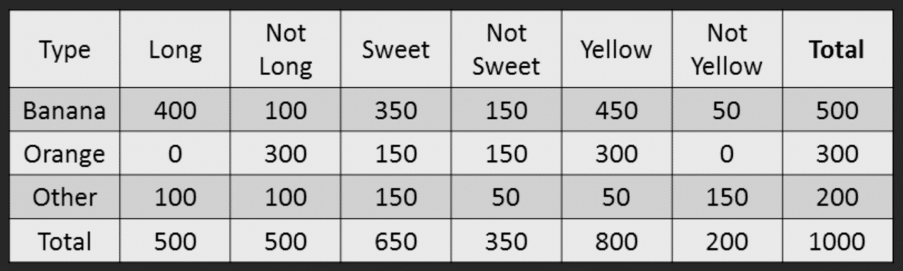

# Naive Bayes with Fruits Example

> Make a classifier to predict from given features if the fruit is from any of Orange, Banana, or Other.

### Dataset

We have a 1000 fruits that can be orange, banana, or other. Assume our dataset has 3 features for each fruit sample.

| Fruit  | Long (x1) | Sweet (x2) | Yellow (x3) |
| ------ | --------- | ---------- | ----------- |
| Orange | 0         | 1          | 0           |
| Banana | 1         | 0          | 1           |
| Banana | 1         | 1          | 1           |
| Other  | 1         | 1          | 0           |
| ..     | ..        | ..         | ..          |

Assume when the data is aggregated to each fruit (we found frequency table), below table is achieved.

### Steps

Method to find the label for a new fruit is simple.

1. Compute the prior probabilities for each class
2. Compute the probability of evidence
3. Compute the probability of likelihood of evidences
4. Substitute all values in naive bayes formula
5. Select highest probability

We now have a new label based on bayes rule.

### Questions

#### Long, Sweet and Yellow, can you predict what fruit it is?

What we are interest in is:

$$
P(Banana|Long, Sweet and Yellow) = 
\dfrac{P(x_1=Long|Banana) * P(x_2=Sweet|Banana) * P(x_3=Yellow|Banana) * P(Banana)}
{P(Long) * P(Sweet) * P(Yellow)}
$$

Find prior probabilities.

- P(Y=Banana) = 500 / 1000 = 0.50
- P(Y=Orange) = 300 / 1000 = 0.30
- P(Y=Other) = 200 / 1000 = 0.20

Find probability of the evidence.

- P(x1=Long) = 500 / 1000 = 0.50
- P(x2=Sweet) = 650 / 1000 = 0.65
- P(x3=Yellow) = 800 / 1000 = 0.80

Find the probability of the likelihood of evidences.

- P(x1=Long | Y=Banana) = 400 / 500 = 0.80
- P(x2=Sweet | Y=Banana) = 350 / 500 = 0.70
- P(x3=Yellow | Y=Banana) = 450 / 500 = 0.90

Put all in the formula:

- P(Banana|Long, Sweet and Yellow) = 0.80 * 0.70 * 0.90 * 0.50 / 0.50 * 0.65 * 0.80
- P(Orange|Long, Sweet and Yellow) = ...
- P(Other|Long, Sweet and Yellow) = ...

Select highest probability of the classes. Answer is max of all class probabilities.
