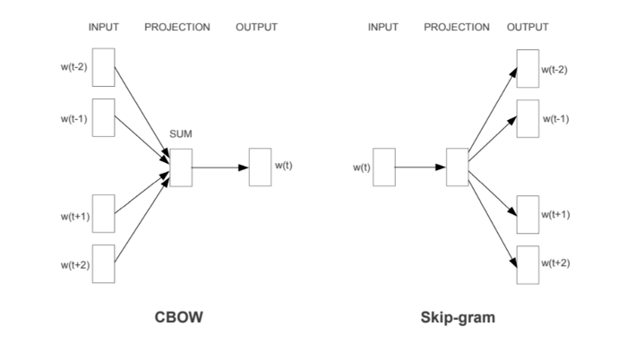

# Natural Language Processing (NLP)

## Introduction

Natural language processing is the field of studying langauges and computer science to develop intelligent applications. NLP helps machines to understand human languages the way humans naturally do. The field involves use of computer science techniques to both speaking and typing.

We can consider 3 aspects of any given text:

- **Semantic information:** Refers to the specific meaning of a word. The word bat in sentence "The bat flies in the sky" can refer to a winged mammal or a wooden stick.
- **Syntax Information**: Refers to sentence or phrase structure. A sentence can have a different meaning with respect to how you read it.
- **Context information**: Understand the context of that a word, phrase appears in a text. The word "sick" can be negative in healthcare, and in the context of a gaming, can refer to positive.

"Tom hit the ball so far". The ball in this sentence can refer to any sport, even tough we may imagine a specific sport.

Below sentence, the three aspects of information would return seperate meanings of the sentence and would not be helpful individually.

> “Billy hit the ball over the house.” 

Semantic information: person – act of striking an object with another object – spherical play item – place people live
Syntax information: subject – action – direct object – indirect object
Context information: this sentence is about a child playing with a ball

To make it work, we need to combine all 3 aspects. NLP can utilize machine learning or rule based/ pattern matching solutions.

### NLP Applications

- Smart Assistants 
- Predictive Text
- Email filters
- Automatic Summarization
- Named Entity Recognition
- Sentiment Analysis
- Speech Recognition
- Topic Segmentation

## Basic NLP Operations

Tokenization (Word, Sentence)
Stopwords Removal
Punctuation Removal
Part of speech tagging
Stemming and Lemmatization

## Text Vectorization

The process of converting words into numbers are called Vectorization.

- Bag of Words
- Word Embeddings

### Word Embeddings

Word embedding is a langauge modeling technique that is used for mapping words to vectors of real numbers. Words or phrases are represented in vector space with multiple dimensions. Word embeddings can be generated through neural networks, co-occurence matrix, probabilistic models, etc. These vectors are used to find word predictions, similarities/ semantics, etc. Some common use cases are:

- Finding similar words (use Euclidean distance, cosine similarity, etc.)
- Text classifications
- Document clustering
- Feature extraction for text classifications

Some well-known pre-trained word embeddings libraries are:

- Word2Vec — From Google
- Fasttext — From Facebook
- GloVe — From Standford

The basic idea of word embedding is words that occur in similar context tend to be closer to each other in vector space.

#### Word2Vec

These models are shallow two layer neural networks having one input layer, one hidden layer and one output layer. Word2Vec utilizes two architectures:

1. Continous Bag of Words(CBOW): the distributed representations of surrounding words combined to **predict the word in the middle**.
2. Skip Gram: the distributed representation of the input word used to **predict the context**.

## Algorithms Used in NLP Tasks

The most popular supervised NLP machine learning algorithms are:

- Support Vector Machines
- Bayesian Networks
- Maximum Entropy
- Conditional Random Field
- Neural Networks / Deep Learning

Some common unsupervised algorithms are:

- Latent Semantic Indexing (LSI)
- Matrix Factorization

## References

https://course.spacy.io/en
https://www.lexalytics.com/lexablog/machine-learning-natural-language-processing
https://www.geeksforgeeks.org/python-word-embedding-using-word2vec/