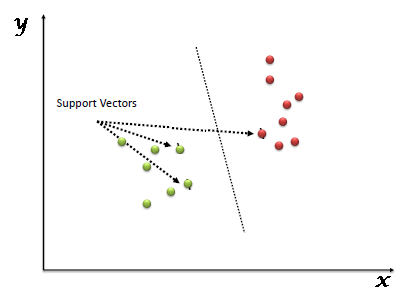

# Support Vector Machines (SVMs)

It is a type of supervised machine learning algorithm used for classification, regression and outlier detection. This algorithm is effective in high dimentional spaces and in datasets where number of dimensions are greater than the sample size.

SVM tries to find the best fitting hyper-plane that seperates different classes of data points. Each data point is plotted in n-dimentional space (n is the # of features
) with each feature being the value of a particular coordinate. The best fitting hyper-plane targets to find the maximum margins (distance) from nearest element of each group.

## References

- https://www.analyticsvidhya.com/blog/2017/09/understaing-support-vector-machine-example-code/
- https://monkeylearn.com/blog/introduction-to-support-vector-machines-svm/