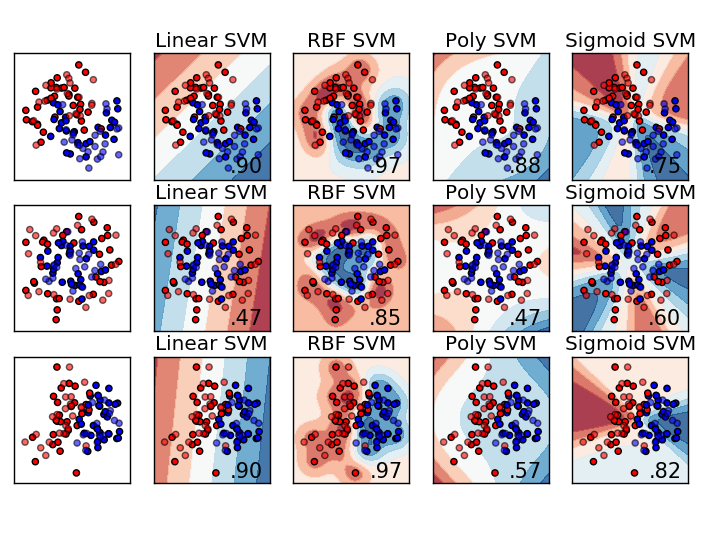

# Support Vector Machines (SVMs)

## Table of Contents 

- [Support Vector Machines (SVMs)](#support-vector-machines-svms)
  - [Table of Contents](#table-of-contents)
  - [Introduction](#introduction)
  - [Advantages and Disadvantages](#advantages-and-disadvantages)
    - [Pros](#pros)
    - [Cons](#cons)
  - [How does it work?](#how-does-it-work)
  - [Kernels](#kernels)
  - [Tuning parameters](#tuning-parameters)
    - [Gamma](#gamma)
    - [Kernel](#kernel)
    - [Regularization](#regularization)
  - [Using SVM](#using-svm)
  - [References](#references)

## Introduction


It is a type of supervised machine learning algorithm used for classification, regression and outlier detection. This algorithm is effective in high dimentional spaces and in datasets where number of dimensions are greater than the sample size.

Lets understand the two terms here:

- Hyper-Plane: A decision boundary plane that differencates the two classes.-
- Support Vectors: The data points that are nearest to the hyper-plane.

SVM tries to find the best fitting hyper-plane that seperates different classes of data points. Each data point is plotted in n-dimentional space (n is the # of features
) with each feature being the value of a particular coordinate. The best fitting hyper-plane targets to find the maximum margins (distance) from nearest element of each group.

## Advantages and Disadvantages

### Pros

- Solution is always global minimum not a local minimum
- Suitable for linear and nonlinear data
- Works well on small and large datasets because they don't need the entire data, as well as low and high dimentional data.

### Cons

- Less effective on noiser datasets or overlapping classes.

## How does it work?

## Kernels 

Kernel function is a method to transform low dimentional input data into the higher dimentional data so that the data can be seperable.


<sub>List of kernel functions and their visualization - [Credit](https://gist.github.com/WittmannF/60680723ed8dd0cb993051a7448f7805)</sub>

Also check out Sklearn's [cLassifier comparison](https://scikit-learn.org/stable/auto_examples/classification/plot_classifier_comparison.html).

## Tuning parameters

### Gamma

It defines how far the effect of a single point can effect in the algorithm.

- Low Gamma -> Points far from the plausible line are considered for calculation
- High Gamma -> Points close to the plausible line are considered for calculation.

### Kernel

The function to define the seperation.

### Regularization

The trade off between smooth decision boundary and classifying training points correctly. A large value of c means you will get more training points correctly.

## Using SVM

You can use [sklearn.svm.SVC](https://scikit-learn.org/stable/modules/generated/sklearn.svm.SVC.html) to implement SVM algorithm.

``` py
import numpy as np
from sklearn.pipeline import make_pipeline
from sklearn.preprocessing import StandardScaler
from sklearn.svm import SVC


X = np.array([[-1, -1], [-2, -1], [1, 1], [2, 1]])
y = np.array([1, 1, 2, 2])

clf = make_pipeline(StandardScaler(), SVC(gamma='auto'))
clf.fit(X, y)
```
## References

Read more on

- https://www.analyticsvidhya.com/blog/2017/09/understaing-support-vector-machine-example-code/
- https://monkeylearn.com/blog/introduction-to-support-vector-machines-svm/
- https://towardsdatascience.com/https-medium-com-pupalerushikesh-svm-f4b42800e989